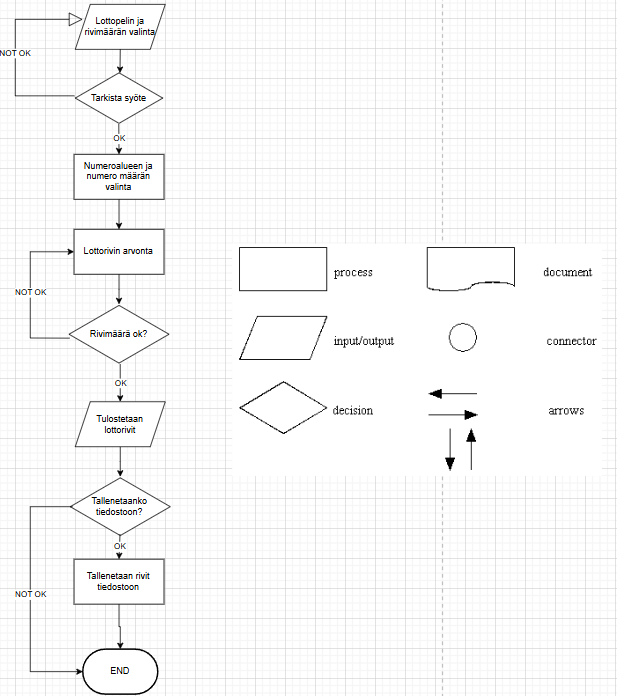

Tämä on repositorio Laurean "Ohjelmoinnin perusteet" -kurssin projektille.

<h1>Lottery application / Lotto sovellus</h1>
Tekijä: Jiro Pärnänen

<h3>Demo-linkki:</h3>
Pääset sivustolleni osoitteessa google.com

<h3>Sisällysluettelo:</h3>
Tietoa sovelluksesta
Kuvakaappaukset
Teknologiat
Asennus
Suunnitelma / Vuokaavio
Tila
Lähteet ja tekijät
Lisenssi

<h3>Tietoa sovelluksesta</h3>
Lotto sovellus luo käyttäjälleen satunnaisia lottorivejä riippuen siitä mitä lottopeliä käyttäjä haluaa pelata.
Sovelluksella voi luoda lottorivejä kolmelle eri lottopelille: Lotto, Vikinglotto, Eurojackpot.
Käyttäjä pystyy luomaan kerralla 1-10 lottoriviä haluttuun peliin.

<h3>Kuvakaappaukset</h3>
Lisää tähän vähintään yksi kuvakaappaus toimivasta sovelluksesta

Kuva: Kelly Sikkema

<h3>Teknologiat</h3>
Kuvaile, mitä teknologioita käytettiin ja mikä rooli niillä oli projektissa.
Käytin seuraavia teknologioita: html, css, ...

<h3>Suunnittelu</h3>

1) Käyttäjältä kysytään, mitä lottopeliä hän haluaa pelata ja kuinka monta riviä hän haluaa (1-10).

2) Sovellus valitsee lottopeliä vastaavat: 
        - Lottonumeroiden määrän ja numeroalueen 
        - Lisänumeroiden määrän ja numeroalueen

3) Numeroiden määrä ja numeroalue syötetään yhteiselle arvontafunktiolle, joka: 
        - Arpoo numerot satunnaislukugeneraattoria hyödyntäen 
        - Varmistaa, että numerot toistuvat vain kerran samalla lottorivillä 
        - Palauttaa valmiin rivin numerolistana

4) Arvontafunktiota kutsutaan niin monta kertaa, kun rivejä halutaan.
     
5) Tulostetaan arvotut rivit näytölle.

6) Lopuksi käyttäjä pystyy valitsemaan haluaako hän tallentaa rivit vielä tiedostoon.

Vuokaavio:

    

<h3>Tila</h3>
Lotto sovellus on vielä työn alla. Ei ole vielä julkaistu.

<h3>Lähteet ja tekijät</h3>
Lista osallistujista ja lähteistä, joita käytit projektin aikana. Mainitse myös, jos käytit ChatGPT:tä tai muita tekoälytyökaluja ja miten ne auttoivat sinua.

John Doe
Beginners guide to BEM

<h3>Lisenssi</h3>
Valitse projektiisi sopiva lisenssi tämän ohjeen avulla.

Esimerkki: MIT-lisenssi © tekijä